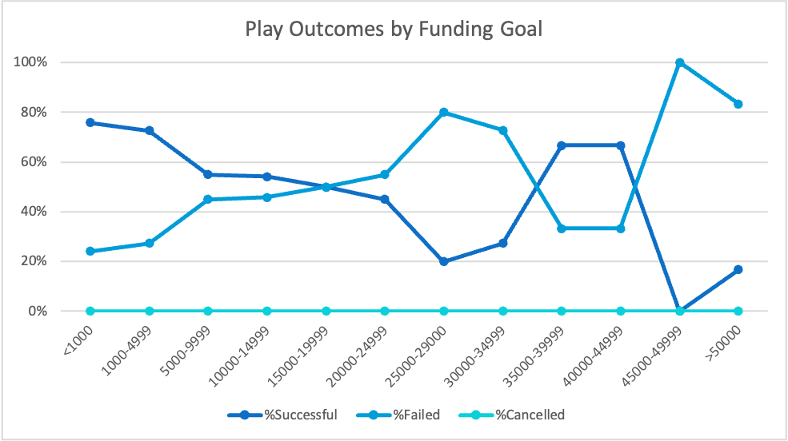

# Kickstarting with Excel

## Overview of Project
This project contains an analysis of outcomes from Kickstarter projects lunched between 2009 and 2017 which fall in the theater category.

### Purpose
This project is intended to provide insights for planning the launch of a Kickstarter project designed to fund a new play, in order to maximize the likelihood the project will be successful. I focused on two areas: the time of year for lauch and the fundraising goal.

## Analysis and Challenges
There were 1369 completed theater projects within this dataset, and I focused only on these. Of these, 61% were successful. I will present analyses of two factors which could influence the probability of success for a new Kickstarter project. 
- First, there could be patterns to potential funders' decisions about what to fund, based on the time of year the project is launched.
- Second, the size of the funding goal will impact the likelihood that investors will choose to support a project. If a goal is too high, they may think the project is unlikely to succeed, and therefore choose not to support it.

### Analysis of Outcomes Based on Launch Date
I have collapsed projects from all years in the dataset, binning launch date into the calendar months. 
![Screenshot with Pivot Table] (Launch_Date_Table.png)

The raw number of projects with each potential outcome is plotted on the y axis, with calendar month on the x axis. 

 

There are very few canceled projects, and they are generally evenly distributed across the months. Therefore the distance between the lines for successful and failed projects reflects the relative likelihood of success.

### Analysis of Outcomes Based on Goals
I then narrowed my analysis to specifically those theater projects which were launched to fund a play. This dataset includes 1043 projects, with a success rate of 67%. The funding goals for these projects ranged from $1 to $200,000. The distribution of goals is highly skewed, with half the projects having a goal of less than 5000 dollars. The projects were binned in $5000 increments except for these, which are separated into <1000 and 1000-4900. All 12 projects with goals >50000 are collapsed into one bin. 

The percentage of successful and failed projects for each funding goal increment is plotted on the y-axis. 

### Challenges and Difficulties Encountered
Initially I had some challenges with achieving the formatting I wanted in the PivotTable, and so in my graph. When initially adding the date launched in the Rows field, I had the Quarters appear in the table. At first I simply went and did a brute force workaround by generating a Month column and using that, but then I realized that I only had to remove the Quarters field that Excel had generated, and I would then have the data binned by month. 
It also took some time to figure out how to remove the (blank) lines, which affected only the aesthetics of the graphs. 

## Results
#### Conclusions regarding Outcomes by Launch Date analysis.
1. The best months for launch will have the largest gap between successful and failed projects. May is the clear winner here, with July and August coming next. It seems that the summer months would be the best time to launch.
- Interestingly, these are also the months with the largest total number of projects launched. A glut of options could have resulted in fewer successful projects, but instead, it seems this is a time of year in which potential funders are looking for options. 

2. By contrast, months where the successful and failed lines are very close would be poor choices. December has only a 50% success rate, and I would advise specifically avoiding project launch during this month.
- December is also the month with the fewest projects launched, further indicating that success rate is not influenced by the number of other projects in effect at the time of launch. 

#### Conclusions regarding Outcomes by Goal analysis.
1. Analyzing success rate by the size of the funding goal suggests that keeping the goal under $5000 is advisable. Most of Kickstarter play projects have done this (79%) and these projects have a success rate of 73%. From there there is a significant dropoff. 

#### Limitations
This analysis excludes 2 variables which could have significant impacts on success rate, and could have interactions with the included factors, namely year of launch, and country of launch. 
1. In the early years of Kickstarter there were far fewer projects, and these projects tended to be more successful in reaching their funding goals. There were 26 theater projects between 2009 and 2013, and all were successful. However, since the most recent behavior is probably most predictive of future behavior, and there are few projects in the early years, it is unlikely that they are significantly influencing the analyses.
2. To maintain the larger sample size I have included all available projects. However, if there are different patterns of behavior among potential funders in different countries, it may be particularly informative to look at only the country of origin for this project. Also, the projects are almost exclusively in countries where English is the primary language. I would take particular care in interpretation of this data for use in any other country. 

#### Potential Next Steps
To address the potential for interaction with year or country, I would run each analysis again, excluding 2009-2013 and limiting them to the client's country of choice. 

